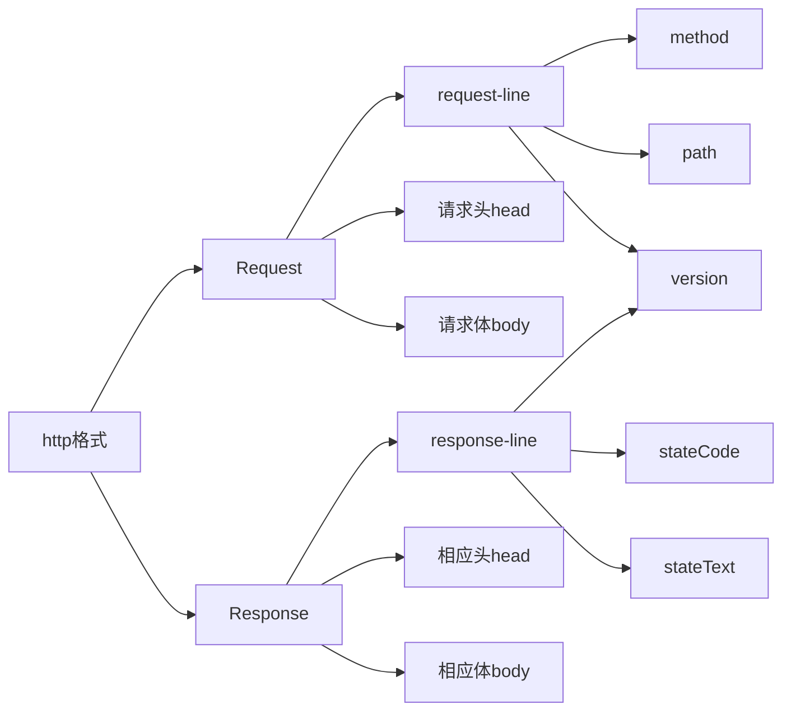

## HTTP（超文本传输协议）

> 用一个面试题引出今天的话题

在浏览器输入url开始到浏览器显示页面发生了什么？

1. DNS解析（网址找IP）
2. TCP连接 ( HTTP协议是使用TCP作为其传输层协议 )
3. 发送HTTP请求 （HTTP请求报文是由三部分组成: 请求行, 请求报头和请求体。）
4. 服务器处理请求并返回HTTP报文（HTTP响应报文也是由三部分组成: 状态码, 响应报头和响应体）
5. 浏览器解析渲染页面（浏览器在收到HTML,CSS,JS文件进行边解析边渲染）【reflow(回流)和repain(重绘)、同步和异步、优化速度】

### Http定义：

- 超文本传输协议（HTTP，HyperText Transfer Protocol)是互联网上应用最为广泛的一种网络协议。
- 所有的 WWW 文件都必须遵守这个标准。设计 HTTP 最初的目的是为了提供一种发布和接收 HTML 页面的方法。
- HTTP 协议（HyperText Transfer Protocol，超文本传输协议）是用于从 WWW 服务器传输超文本到本地浏览器的传输协议。它可以使浏览器更加高效，使网络传输减少。它不仅保证计算机正确快速地传输超文本文档，还确定传输文档中的哪一部分，以及哪部分内容首先显示(如文本先于图形)等。

### 标准

> HTTP 标准由 IETF 组织制定，是一个客户端和服务器端请求和应答的标准（TCP）

1. HTTP1.1 https://tools.ietf.org/html/rfc2616

2. HTTP1.1 https://tools.ietf.org/html/rfc7234

### 格式



#### 1. HTTP Request Header(客户端->服务端[request])

```bash
   GET(请求的方式) /newcoder/hello.html(请求的目标资源) HTTP/1.1(请求采用的协议和版本号)
   Accept: _/_                          (客户端能接收的资源类型)
   Accept-Language: en-us               (客户端接收的语言类型)
   Accept-Encoding: gzip, deflate       (客户端能接收的压缩数据的类型)
   Connection: Keep-Alive               (维护客户端和服务端的连接关系)
   Host: localhost:8080                 (连接的目标主机和端口号)
   Referer: http://localhost/links.asp  (告诉服务器我来自于哪里)
   User-Agent: Mozilla/4.0              (客户端版本号的名字)
   If-Modified-Since: Tue, 11 Jul 2000 18:23:51 GMT(缓存时间)
   Cookie                               (客户端暂存服务端的信息)
   Date: Tue, 11 Jul 2000 18:23:51 GMT  (客户端请求服务端的时间)
```

#### 2. HTTP Response Header(服务端->客户端[response])

```bash
   HTTP/1.1(响应采用的协议和版本号) 200(状态码) OK(描述信息)
   Location: http://www.baidu.com           (服务端需要客户端访问的页面路径)
   Server:apache tomcat                     (服务端的 Web 服务端名)
   Content-Encoding: gzip                   (服务端能够发送压缩编码类型)
   Content-Length: 80                       (服务端发送的压缩数据的长度)
   Content-Language: zh-cn                  (服务端发送的语言类型)
   Content-Type: text/html; charset=GB2312  (服务端发送的类型及采用的编码方式)
   Last-Modified: Tue, 11 Jul 2000 18:23:51 GMT(服务端对该资源最后修改的时间)
   Refresh: 1;url=http://www.it315.org      (服务端要求客户端1秒钟后，刷新，然后访问指定的页面路径)
   Content-Disposition: attachment; filename=aaa.zip(服务端要求客户端以下载文件的方式打开该文件)
   Transfer-Encoding: chunked               (分块传递数据到客户端）
    Set-Cookie:SS=Q0=5Lb_nQ; path=/search   (服务端发送到客户端的暂存数据)
   Expires: -1                          #3种(服务端禁止客户端缓存页面数据)
   Cache-Control: no-cache                  (服务端禁止客户端缓存页面数据)
   Pragma: no-cache                         (服务端禁止客户端缓存页面数据)
   Connection: close(1.0)/(1.1)Keep-Alive   (维护客户端和服务端的连接关系)
   Date: Tue, 11 Jul 2000 18:23:51 GMT      (服务端响应客户端的时间)
```

在服务器响应客户端的时候，带上 Access-Control-Allow-Origin 头信息，解决跨域的一种方法。

#### 3. HTTP Request Body

- application/json
- application/x-www-form-urlencoded（html的form标签提交产生的html请求）
- multipart/form-data(html的form标签文件上传)
- text/xml

#### 4.HTTP Method（方法）

- GET
- POST
- HEAD
- PUT
- DELETE
- CONNECT
- OPTIONS、TRACE（一般是调试）

#### 5.HTTP Status与Text

- 1xx：临时回应，表示客户端请继续。
- 2xx：请求成功。
  - 200：请求成功。
- 3xx: 表示请求的目标有变化，希望客户端进一步处理。
  - 301/302：永久性与临时性跳转。
  - 304：跟客户端缓存没有更新。
- 4xx：客户端请求错误。
  - 403：无权限。
  - 404：表示请求的页面不存在。
- 5xx：服务端请求错误。
  - 500：服务端错误。
  - 503：服务端暂时性错误，可以一会再试。

#### 6.HTTP 2

[http2.0](https://tools.ietf.org/html/rfc7540)

> HTTP 2 是 HTTP 1.1 的升级版本;HTTP 2.0 最大的改进有两点

- 支持服务端推送，
- 支持 TCP 连接复用。

> 服务端推送能够在客户端发送第一个请求到服务端时，提前把一部分内容推送给客户端，放入缓存当中，这可以避免客户端请求顺序带来的并行度不高，从而导致的性能问题。

> TCP 连接复用，则使用同一个 TCP 连接来传输多个 HTTP 请求，避免了 TCP 连接建立时的三次握手开销，和初建 TCP 连接时传输窗口小的问题。
